# FoodZero - User Flow Diagrams

## Overview
This document contains Mermaid diagrams for all user flows in the FoodZero platform.
You can render these diagrams using Mermaid Live Editor (https://mermaid.live) or any Mermaid-compatible tool.

---

## 1. Overall System Flow

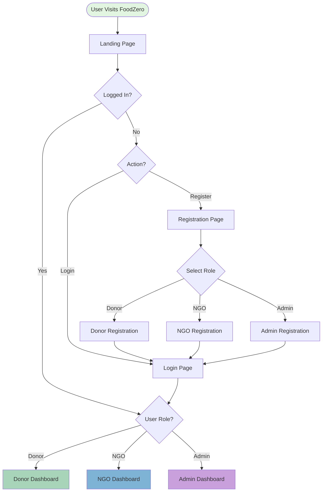

---

## 2. Donor Complete Flow

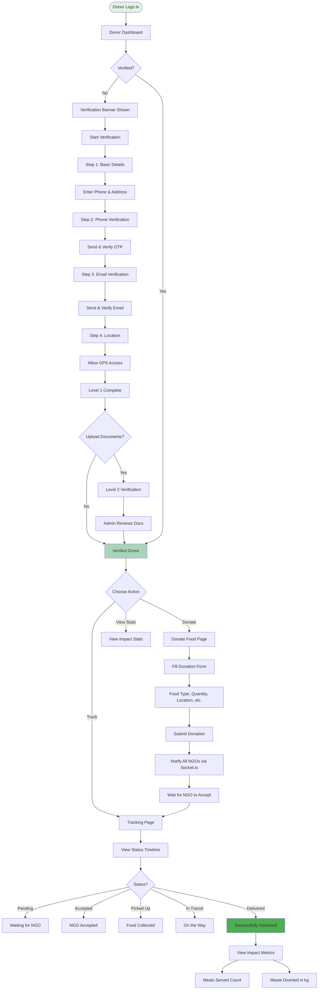

---

## 3. NGO Complete Flow

```mermaid
graph TB
    NGOStart([NGO Logs In]) --> NGODash[NGO Dashboard]
    NGODash --> CheckNGOVerif{Verified?}
    
    CheckNGOVerif -->|No| VerifForm[Verification Form Shown]
    VerifForm --> FillDetails[Fill NGO Details]
    FillDetails --> RegDetails[Registration Number, Type, Address]
    RegDetails --> ContactInfo[Contact Person, Phone]
    ContactInfo --> OptionalDocs[GST, PAN, Website]
    OptionalDocs --> SubmitNGO[Submit for Verification]
    SubmitNGO --> AdminQueue[Admin Review Queue]
    AdminQueue --> AdminDecision{Admin Decision}
    
    AdminDecision -->|Approved| VerifiedNGO[Verified NGO]
    AdminDecision -->|Rejected| Rejected[Rejected - Resubmit]
    Rejected --> VerifForm
    
    CheckNGOVerif -->|Yes| VerifiedNGO
    VerifiedNGO --> NGOActions{Choose Action}
    
    NGOActions -->|View Requests| RequestsPage[Requests Page]
    NGOActions -->|Dashboard| ViewNearby[View Nearby Donations]
    NGOActions -->|My Accepted| MyAccepted[My Accepted Donations]
    
    RequestsPage --> Tabs{Select Tab}
    Tabs -->|Available| AvailableTab[Available Requests]
    Tabs -->|Accepted| AcceptedTab[My Accepted]
    
    AvailableTab --> BrowseDonations[Browse Available Donations]
    BrowseDonations --> ViewDetails[View Donation Details]
    ViewDetails --> DonationInfo[Food Type, Quantity, Distance]
    DonationInfo --> DonorInfo[Donor Contact & Address]
    DonorInfo --> AcceptBtn[Click Accept Donation]
    AcceptBtn --> DonationAccepted[Donation Accepted]
    
    DonationAccepted --> AcceptedTab
    AcceptedTab --> ManageDonation[Manage Accepted Donation]
    ManageDonation --> ViewMap[View Pickup Location on Map]
    ViewMap --> UpdateStatus{Update Status}
    
    UpdateStatus -->|Picked Up| MarkPickedUp[Mark as Picked Up]
    UpdateStatus -->|In Transit| MarkTransit[Mark In Transit]
    UpdateStatus -->|Delivered| MarkDelivered[Mark as Delivered]
    
    MarkPickedUp --> CaptureLocation1[Capture GPS Location]
    MarkTransit --> CaptureLocation2[Capture GPS Location]
    MarkDelivered --> CaptureLocation3[Capture GPS Location]
    
    CaptureLocation3 --> FeedbackPrompt[Feedback Prompt]
    FeedbackPrompt --> SubmitFeedback[Submit Feedback]
    SubmitFeedback --> UploadPhotos[Upload Food Photos]
    UploadPhotos --> Rating[Rate Donation 1-5 Stars]
    Rating --> Comments[Add Comments]
    Comments --> RecipientCount[Enter Recipient Count]
    RecipientCount --> FeedbackComplete[Feedback Submitted]
    
    FeedbackComplete --> ImpactMetrics[View Impact Metrics]
    ImpactMetrics --> TotalMeals[Total Meals Saved]
    ImpactMetrics --> TotalWaste[Total Waste Diverted]
    
    style NGOStart fill:#e3f2fd
    style VerifiedNGO fill:#7fb3d5
    style FeedbackComplete fill:#2196f3
```

---

## 4. Admin Complete Flow

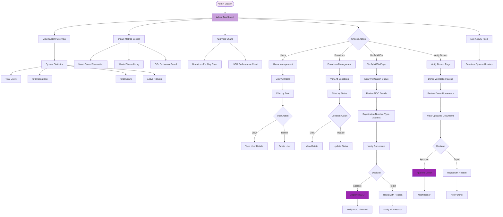

---

## 5. Donation Lifecycle Flow

```mermaid
graph LR
    Create([Donor Creates Donation]) --> Pending[Status: PENDING]
    Pending --> Notify[Notify All NGOs]
    Notify --> NGOSees[NGOs See Donation]
    NGOSees --> NGOAccepts{NGO Accepts?}
    
    NGOAccepts -->|Yes| Accepted[Status: ACCEPTED]
    NGOAccepts -->|No| Pending
    
    Accepted --> NGOPickup[NGO Goes to Pickup]
    NGOPickup --> PickedUp[Status: PICKED_UP]
    PickedUp --> InTransit[Status: IN_TRANSIT]
    InTransit --> Delivered[Status: DELIVERED]
    
    Delivered --> Feedback[NGO Submits Feedback]
    Feedback --> Complete([Donation Complete])
    
    style Create fill:#e1f5e1
    style Pending fill:#fff9c4
    style Accepted fill:#b3e5fc
    style PickedUp fill:#ce93d8
    style InTransit fill:#90caf9
    style Delivered fill:#a5d6a7
    style Complete fill:#4caf50
```

---

## 6. Verification Flow - Donors

```mermaid
graph TB
    Start([Donor Registers]) --> Dashboard[Login to Dashboard]
    Dashboard --> VerifCheck{Verified?}
    
    VerifCheck -->|No| ShowBanner[Show Verification Banner]
    ShowBanner --> VerifProgress[Show Progress: 0/4]
    
    VerifProgress --> Step1Start[Step 1: Basic Details]
    Step1Start --> EnterPhone[Enter Phone Number]
    EnterPhone --> EnterAddress[Enter Full Address]
    EnterAddress --> SelectType[Select Donor Type]
    SelectType --> RequestLocation[Request GPS Location]
    RequestLocation --> LocationGranted{Location Granted?}
    
    LocationGranted -->|Yes| SaveDetails[Save Details]
    LocationGranted -->|No| LocationError[Show Error]
    LocationError --> RequestLocation
    
    SaveDetails --> Progress1[Progress: 1/4]
    Progress1 --> Step2Start[Step 2: Phone Verification]
    
    Step2Start --> SendOTP[Send OTP to Phone]
    SendOTP --> EnterOTP[User Enters OTP]
    EnterOTP --> VerifyOTP{OTP Valid?}
    
    VerifyOTP -->|Yes| PhoneVerified[Phone Verified ✓]
    VerifyOTP -->|No| OTPError[Invalid OTP]
    OTPError --> EnterOTP
    
    PhoneVerified --> Progress2[Progress: 2/4]
    Progress2 --> Step3Start[Step 3: Email Verification]
    
    Step3Start --> SendEmail[Send Verification Email]
    SendEmail --> ClickLink[User Clicks Link/Enters Token]
    ClickLink --> VerifyEmail{Token Valid?}
    
    VerifyEmail -->|Yes| EmailVerified[Email Verified ✓]
    VerifyEmail -->|No| EmailError[Invalid Token]
    EmailError --> SendEmail
    
    EmailVerified --> Progress3[Progress: 3/4]
    Progress3 --> Step4Start[Step 4: Location Verification]
    
    Step4Start --> RequestGPS[Request GPS Access]
    RequestGPS --> CaptureGPS{GPS Captured?}
    
    CaptureGPS -->|Yes| LocationVerified[Location Verified ✓]
    CaptureGPS -->|No| GPSError[GPS Error]
    GPSError --> RequestGPS
    
    LocationVerified --> Progress4[Progress: 4/4]
    Progress4 --> Level1Complete[Level 1 Complete]
    
    Level1Complete --> OptionalL2{Upload Documents?}
    OptionalL2 -->|Yes| UploadDocs[Upload Govt ID]
    OptionalL2 -->|No| BasicVerified[Basic Verification Complete]
    
    UploadDocs --> AdminReview[Admin Reviews]
    AdminReview --> AdminApproves{Approved?}
    AdminApproves -->|Yes| FullyVerified[Fully Verified ✓✓]
    AdminApproves -->|No| DocsRejected[Documents Rejected]
    DocsRejected --> UploadDocs
    
    VerifCheck -->|Yes| CanDonate[Can Create Donations]
    BasicVerified --> CanDonate
    FullyVerified --> PremiumFeatures[Access Premium Features]
    
    style Start fill:#e1f5e1
    style Level1Complete fill:#a8d5ba
    style FullyVerified fill:#4caf50
```

---

## 7. Verification Flow - NGOs

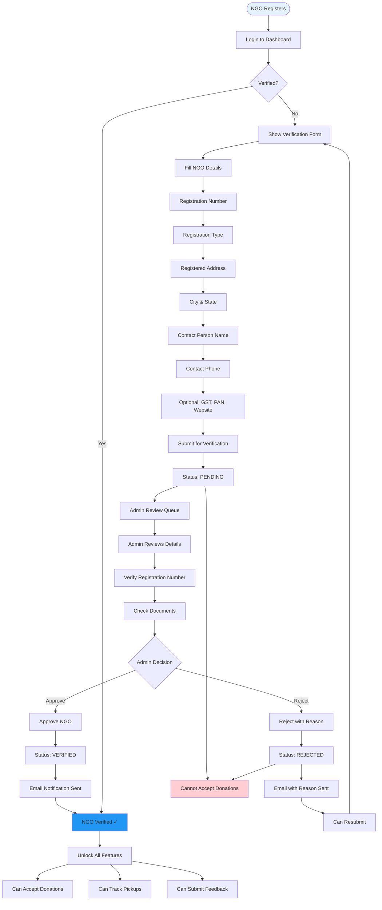

---

## 8. Real-Time Notification Flow

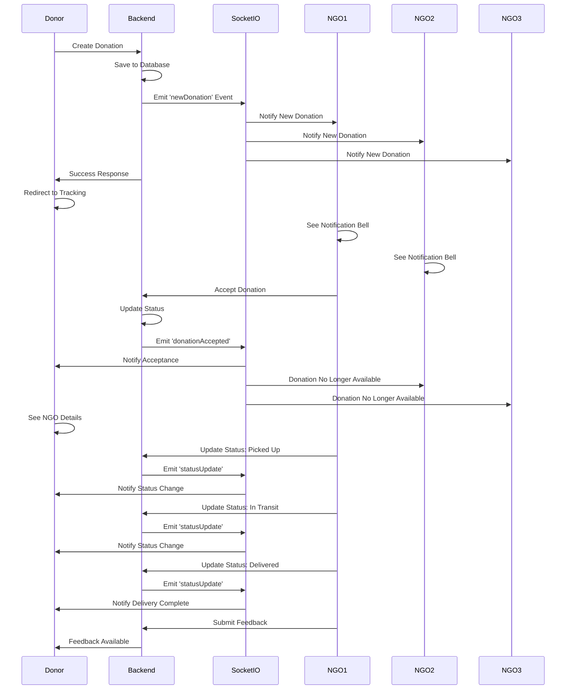

---

## 9. Impact Metrics Calculation Flow

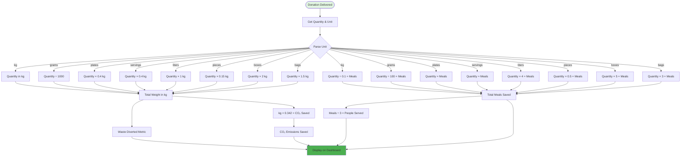

---

## 10. Authentication & Authorization Flow

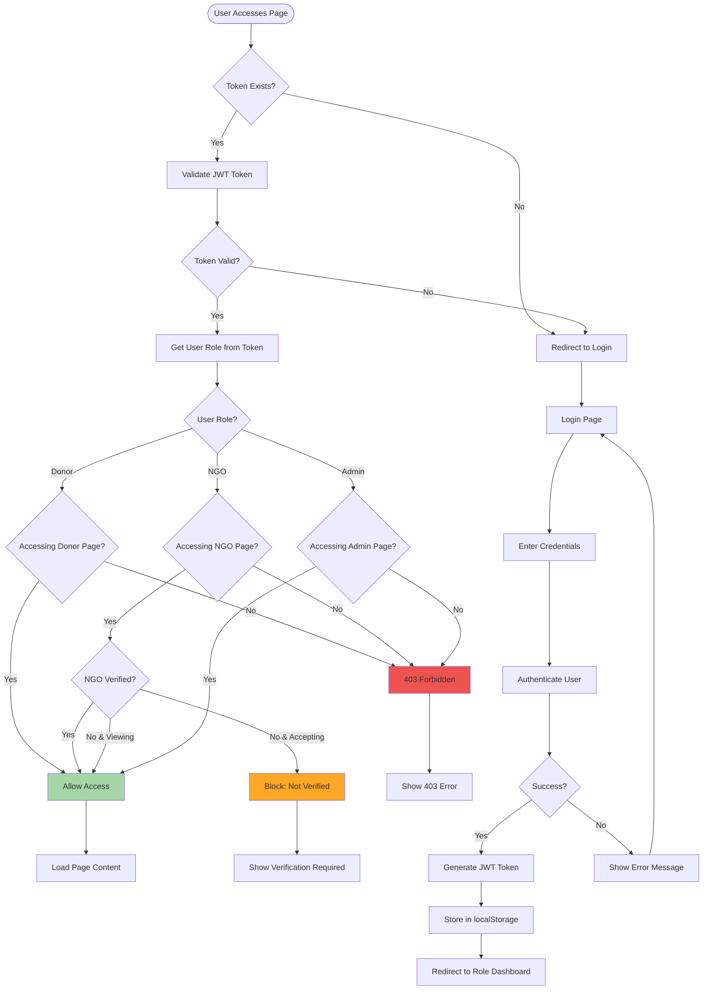

---

## 11. Simplified User Journey - Donor

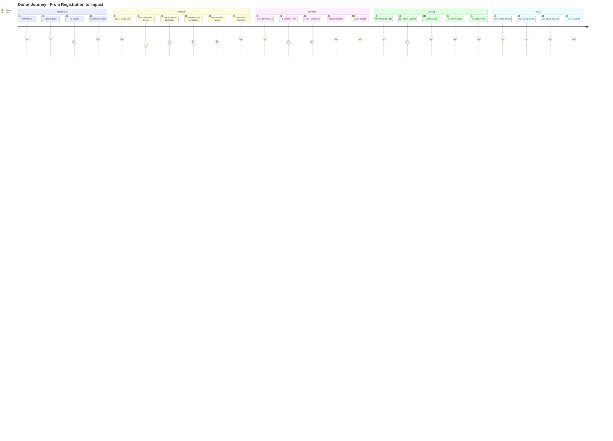

---

## 12. Simplified User Journey - NGO

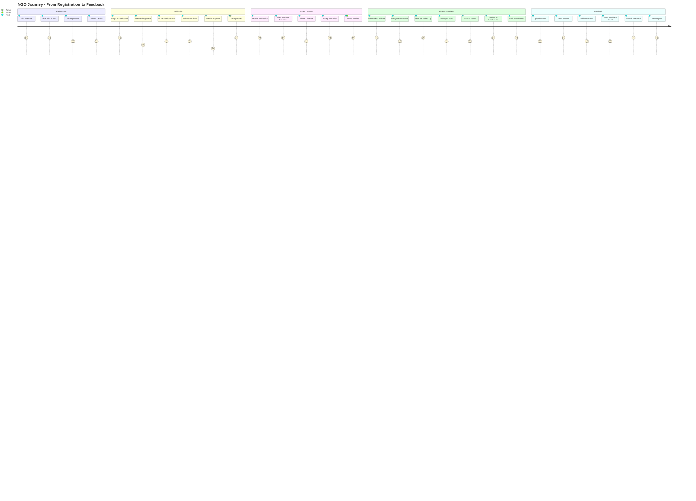

---

## 13. Simplified User Journey - Admin

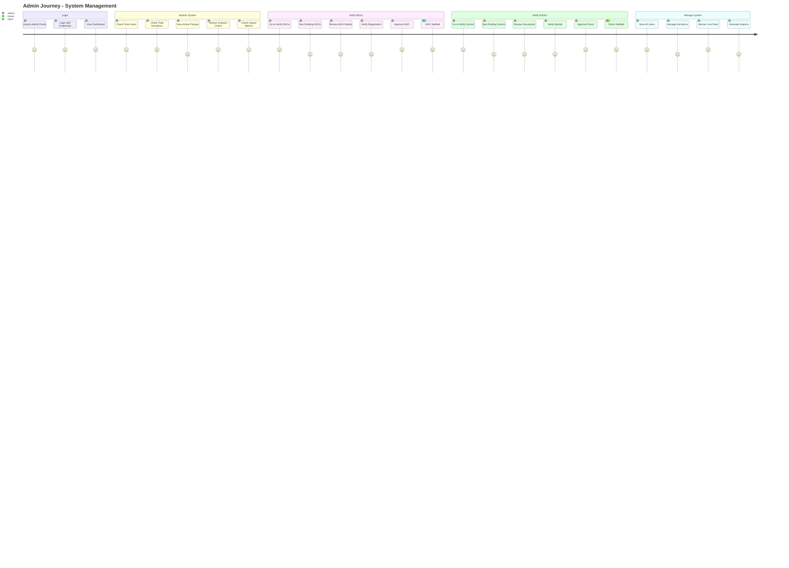

---

## 14. Data Flow Architecture

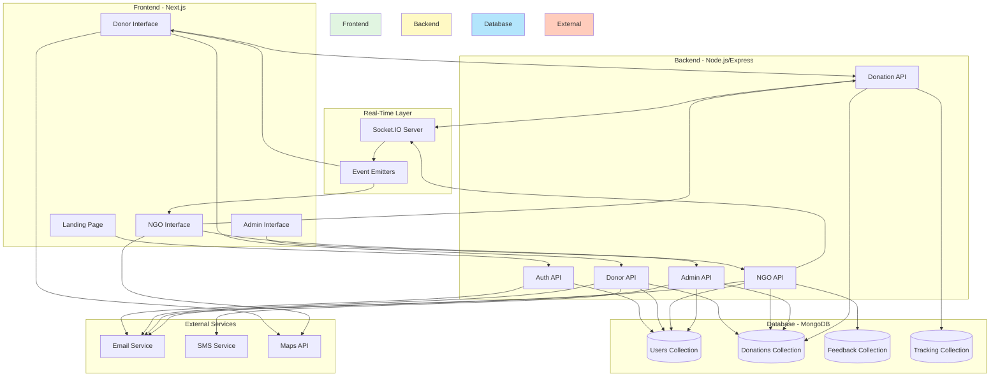

---

## 15. Status Transition Diagram

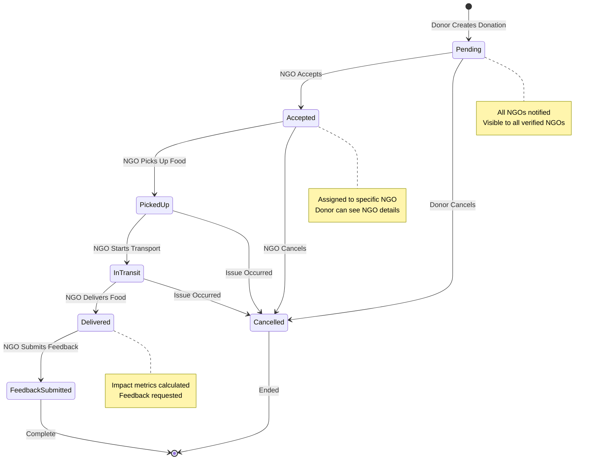

---

## How to Use These Diagrams

### For PowerPoint/Presentations:
1. Copy any diagram code
2. Go to https://mermaid.live
3. Paste the code
4. Export as PNG/SVG
5. Insert into your PPT

### For Documentation:
- These diagrams render automatically in GitHub, GitLab, and many markdown viewers
- Use in README files, documentation sites, or wikis

### Customization:
- Modify colors using `style` commands
- Add/remove nodes as needed
- Adjust flow direction (TB=top-bottom, LR=left-right)

---

## Summary of Diagrams

1. **Overall System Flow** - High-level system overview
2. **Donor Complete Flow** - Full donor journey with verification
3. **NGO Complete Flow** - Full NGO journey with verification
4. **Admin Complete Flow** - Admin management workflows
5. **Donation Lifecycle** - Status progression of donations
6. **Donor Verification Flow** - Detailed verification steps
7. **NGO Verification Flow** - NGO approval process
8. **Real-Time Notifications** - Socket.IO sequence diagram
9. **Impact Metrics Calculation** - How metrics are computed
10. **Authentication & Authorization** - Security flow
11. **Donor Journey** - User journey map
12. **NGO Journey** - User journey map
13. **Admin Journey** - User journey map
14. **Data Flow Architecture** - System architecture
15. **Status Transition** - State machine diagram

---

**Total Diagrams**: 15
**Diagram Types**: Flowcharts, Sequence Diagrams, Journey Maps, State Diagrams, Architecture Diagrams
**Ready for**: PowerPoint, Documentation, Presentations, Technical Specs
